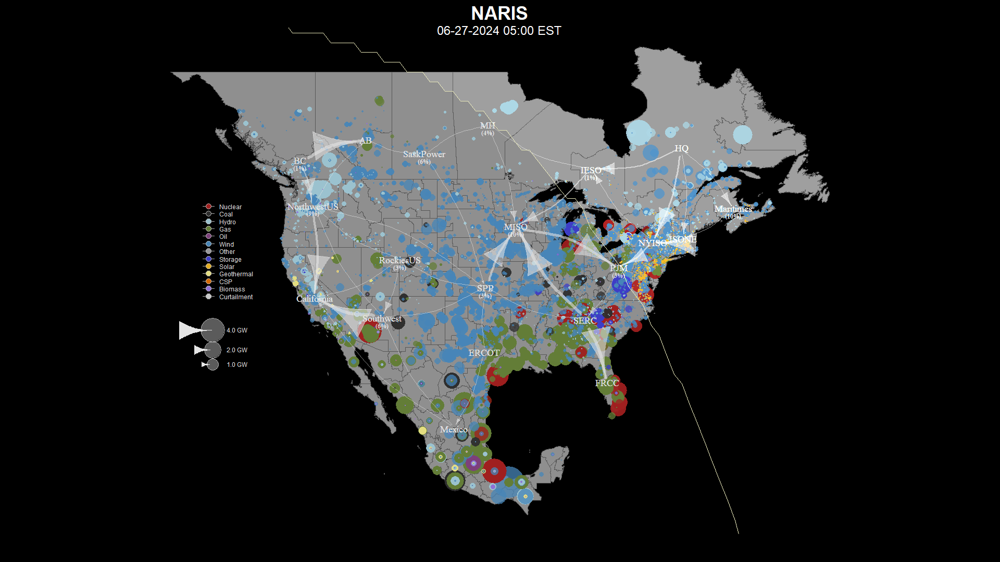
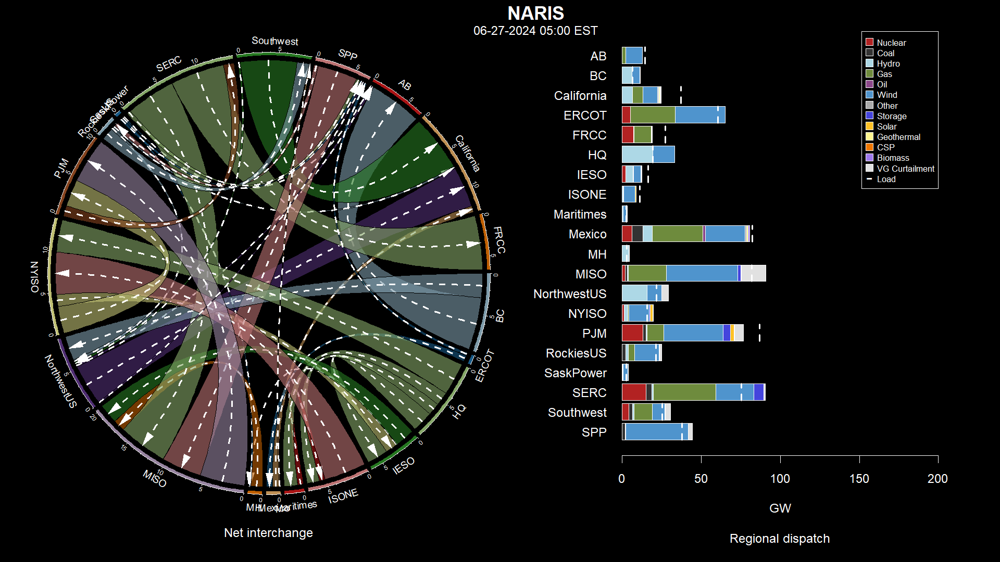
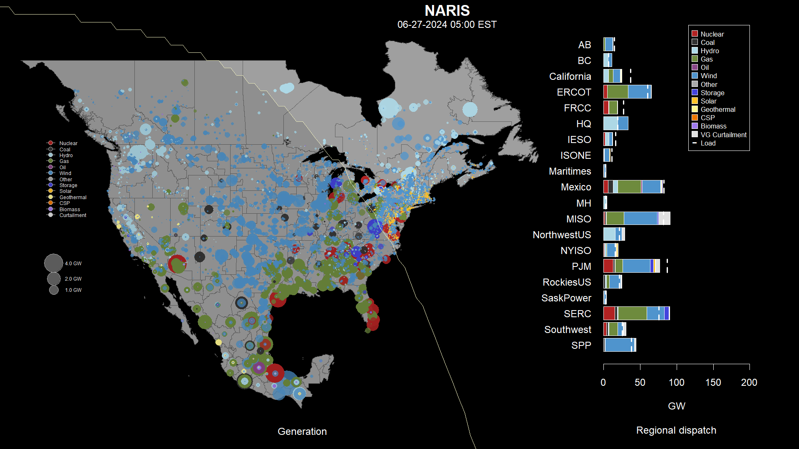
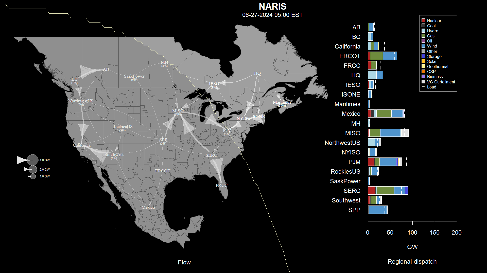
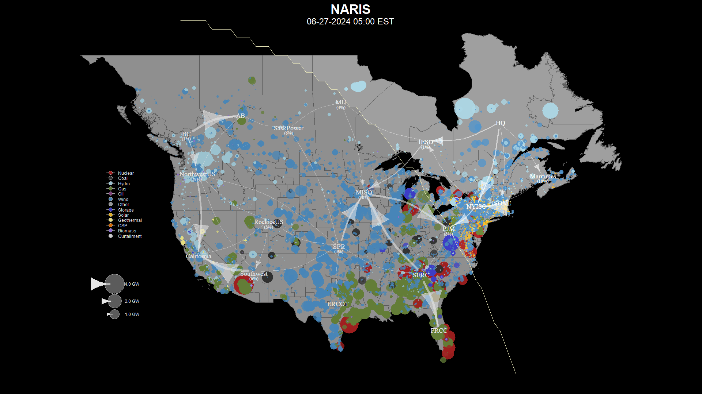
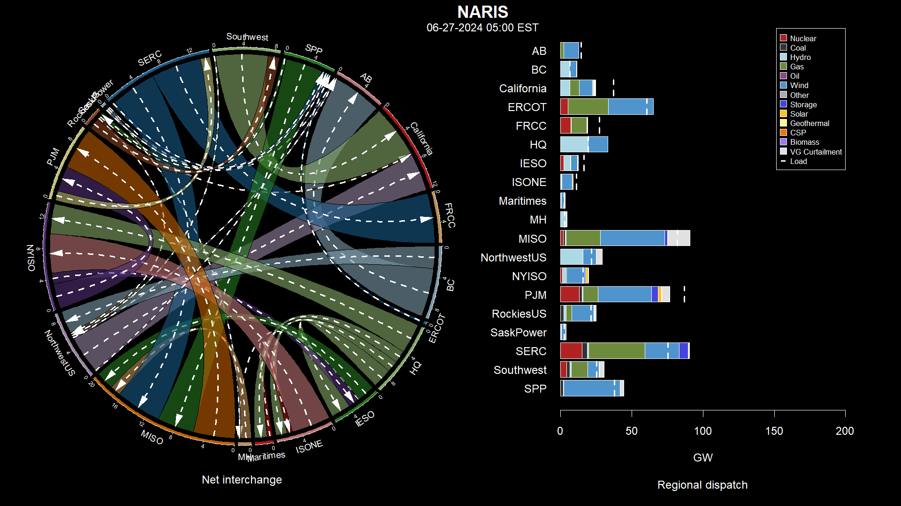
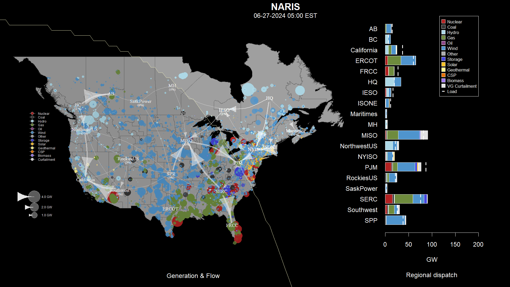
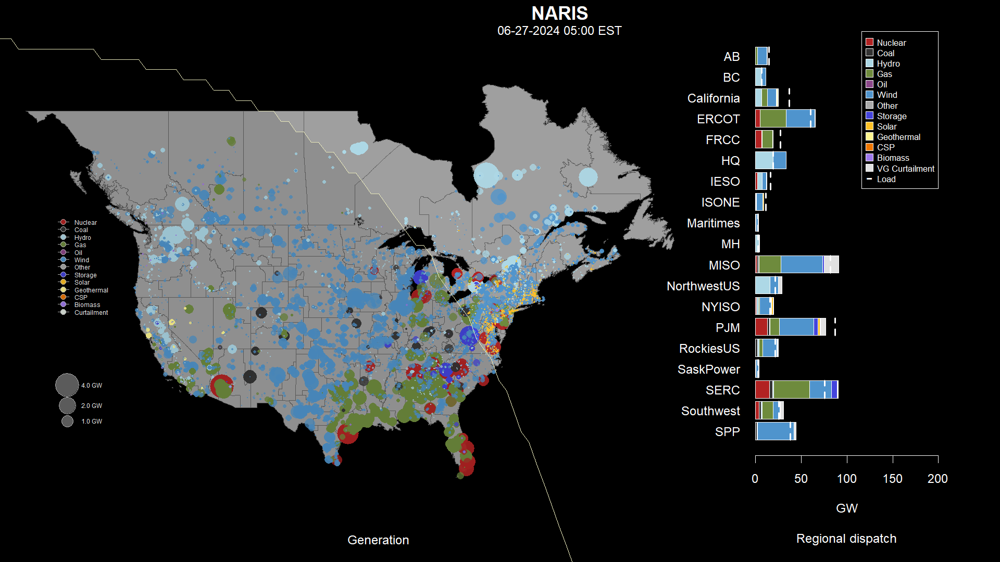
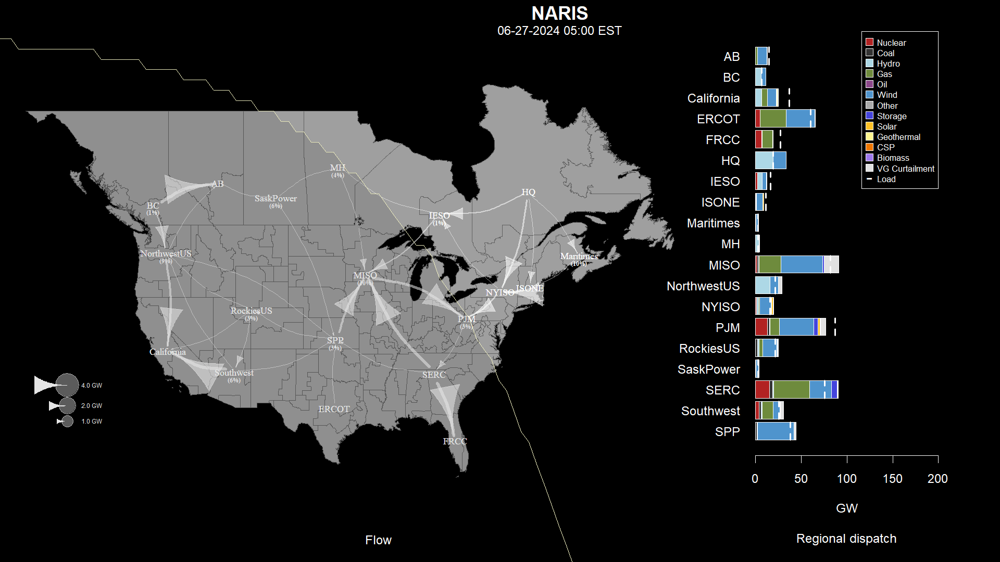

# NARIS kaleidoscope

`NARIS` is an hourly visualization tool that analyzes the production cost modeling results from the [`North American Renewable Integration Study (NARIS)`](https://www.nrel.gov/analysis/naris.html), a study aimed to illuminate possible power system futures and explore how the United States, Canada, and Mexico can collaborate to enable economic competitiveness and reliability as wind, solar, hydropower, and natural gas continue to grow. This tool utilizes NREL's `kaleidoscope` package. 

### kaleidoscope

`kaleidoscope` is an R package developed to visualize PLEXOS scenarios as packaged by the [`rplexos`](https://github.com/NREL/rplexos) R package. The package provides three types of visualizations intended to be used as coordinated views: a geographic diagram, a chord diagram, and dispatch charts. The geographic diagram provides a qualitative view of the study domain representing individual generator output and interregional transmission flows. The chord diagrams provide a more quantitative view of the net interchange between each of the regions. The dispatch charts are stacked and grouped bar charts providing an instantaneous snapshot of the generation mix by ISO and scenario. 

This package was developed to analyze data from the [`Eastern Renewable Generation Integration Study (ERGIS)`](http://www.nrel.gov/grid/ergis.html), a scenario-based study of four potential wind and PV futures and associated operational impacts in the Eastern Interconnection. 

### NARIS kaleidoscope example

```
Generation map
```


```
Interface chord and dispatch views
```


```
Generation map and dispatch views
```


```
Generation map (Generation only) and dispatch views
```


```
Generation map (Net Interchange only) and dispatch views
```


```
Generation map excluding Mexico
```


```
Interface chord and dispatch views excluding Mexico
```


```
Generation map and dispatch views excluding Mexico
```


```
Generation map (Generation only) and dispatch views excluding Mexico
```


```
Generation map (Net Interchange only) and dispatch views excluding Mexico
```



### Instruction

1. Download the NARIS kaleidoscope package - NARIS-kaleidoscope-master.zip.
2. Unzip the package. This will create the folder NARIS-kaleidoscope-master.
3. Open the R project - naris_kaleidoscope.Rproj - in R Studio.
4. Open the R file - naris_app.R.
   - Go to lines 48 and 49 to update the start and end period.
   - Go to lines 54 to select the resource type (e.g., Solar, Wind, etc.).
   - Go to line 58 to include or exclude Mexico.
5. Run the R file by clicking the "Source" button.
6. Open the animation folder to see the results.

### Further questions

Please feel free to email Jo Ann Rañola at JoAnn.Ranola@nrel.gov for further questions.

- - - 
